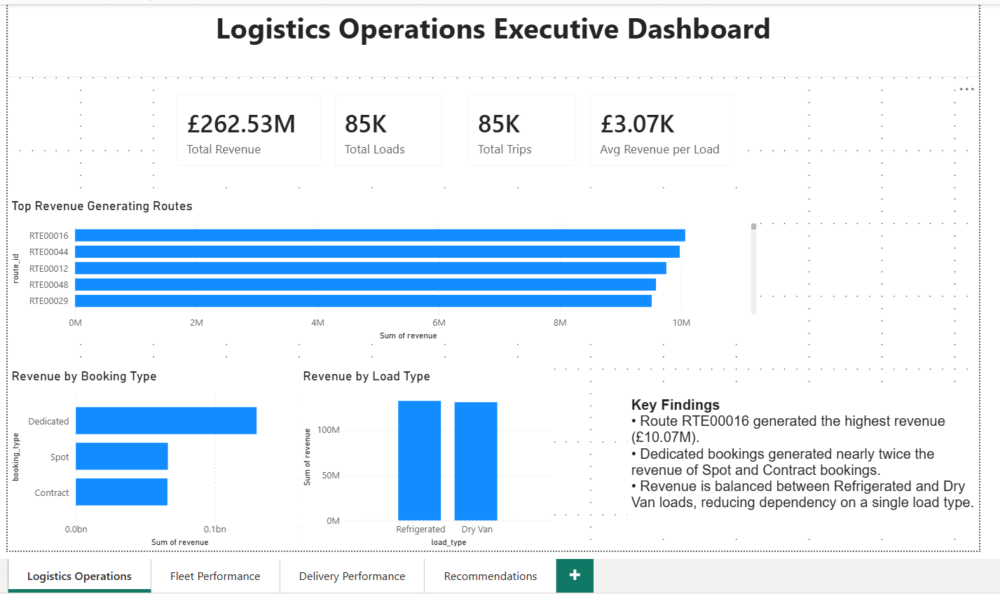
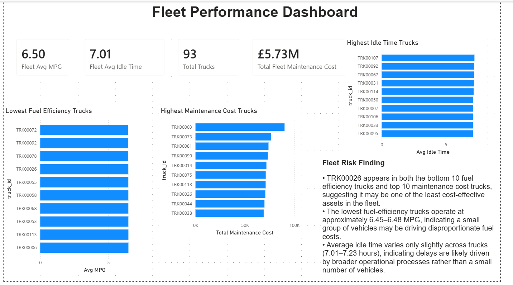
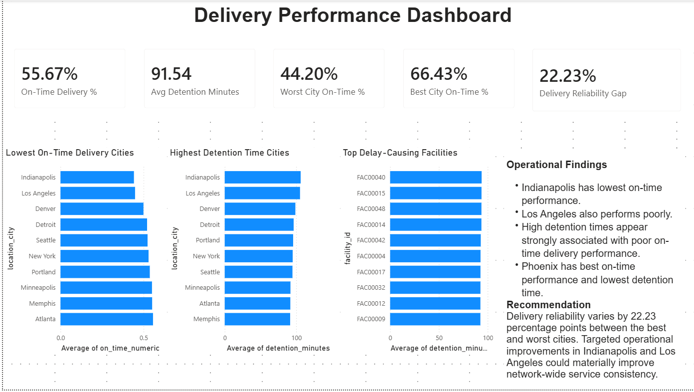
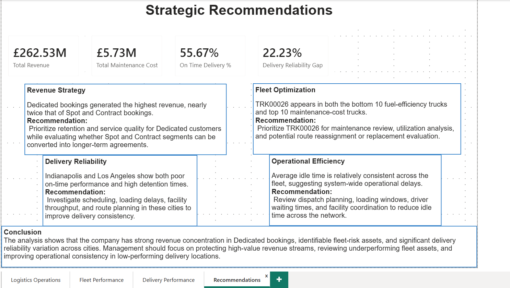

# Logistics Operations Performance & Cost Optimisation Analysis

## Project Overview

This project analyses logistics operations data using Excel, Power BI, and DAX to identify revenue drivers, fleet efficiency issues, maintenance costs, and delivery performance bottlenecks.

The objective was to provide actionable business insights and strategic recommendations to improve operational efficiency and profitability.

---

## Tools Used

- Excel
- Power BI
- DAX
- Pivot Tables
- Data Modelling

---

## Key Business Questions

### Revenue Analysis

- Which routes generate the highest revenue?
- Which load type generates the most revenue?
- Which booking type generates the most revenue?

### Fleet Performance

- Which trucks have the lowest fuel efficiency?
- Which trucks incur the highest maintenance costs?
- Which trucks represent the greatest operational risk?

### Delivery Performance

- Which cities have the poorest on-time performance?
- Which cities experience the highest detention times?
- Which facilities contribute most to delivery delays?

---

## Key Findings

### Revenue

- Route RTE00016 generated the highest revenue (~£10.07M).
- Dedicated bookings generated significantly higher revenue than Spot and Contract bookings.
- Revenue remained balanced between Refrigerated and Dry Van load types.

### Fleet

- TRK00026 appeared in both the bottom fuel-efficiency group and top maintenance-cost group.
- Fleet average fuel efficiency was 6.50 MPG.
- Average idle time remained relatively consistent across trucks.

### Delivery

- Indianapolis recorded the lowest on-time performance (44.20%).
- Phoenix recorded the highest on-time performance (66.43%).
- Indianapolis and Los Angeles recorded the highest average detention times.

---

## Strategic Recommendations

1. Protect and expand Dedicated customer relationships.
2. Review TRK00026 for maintenance and replacement evaluation.
3. Improve operational processes in Indianapolis and Los Angeles.
4. Reduce detention times through scheduling and facility throughput improvements.

---

## Dashboard Pages

### Logistics Operations Executive Dashboard

### Fleet Performance Dashboard

### Delivery Performance Dashboard

### Strategic Recommendations

---

## Skills Demonstrated

- Power BI Dashboard Development
- DAX Measures & KPIs
- Data Modeling & Relationships
- Business Intelligence Reporting
- Logistics Analytics
- Fleet Performance Analysis
- Delivery Performance Analysis
- Executive Dashboard Design
- Data Visualization
- Strategic Recommendation Development
